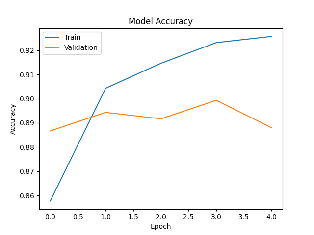
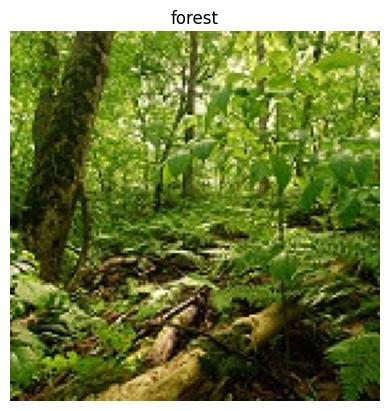

# Scene Classification for Geospatial Image Analysis using CNN

## Overview

This project implements a deep learning model to classify environmental scenes using Convolutional Neural Networks (CNN) and MobileNetV2 transfer learning. The model learns to identify different types of natural and urban scenes from images.

## Dataset

Intel Image Classification Dataset

Dataset Details:

* Total Images: ~25,000
* Image Size: 150 × 150
* Classes: 6

Classes:

* Buildings
* Forest
* Glacier
* Mountain
* Sea
* Street

## Technologies Used

* Python
* TensorFlow / Keras
* CNN (Convolutional Neural Networks)
* MobileNetV2 (Transfer Learning)
* NumPy
* Matplotlib
* Scikit-learn
* Google Colab

## Model Architecture

Input Image → MobileNetV2 (Pretrained CNN) → Global Average Pooling → Dense Layer → Scene Prediction

## Results

Training Accuracy: ~92%
Validation Accuracy: ~88%

The model demonstrates strong performance in classifying environmental scenes using transfer learning.

## Trained Model

The trained model is saved as:

scene_classification_model.h5

This file can be loaded to perform scene classification without retraining the model.

## Model Training Accuracy

## Prediction Example

Example output from the trained CNN model.

### Forest Scene Prediction

The model correctly identifies the environmental scene as **Forest**.

## Applications

* Scene understanding
* Environmental monitoring
* Geospatial image analysis
* Computer vision research

## Repository Structure

scene-classification-geospatial-analysis/

scene_classification.ipynb
README.md

## Author

Artificial Intelligence & Machine Learning Student
Project developed as part of deep learning and computer vision practice.
